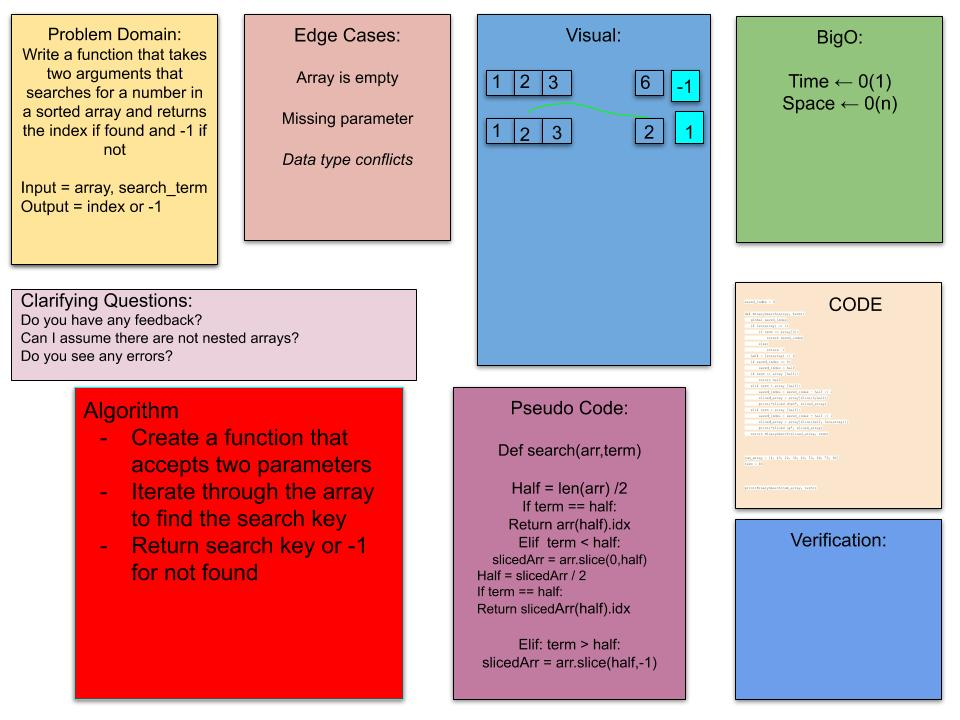

# Array Binary Search 12.14.2020
Search in an array without using a pre-existing method. 

## Challenge
Write a function called `BinarySearch` which takes in 2 parameters: a sorted array and the search key. Without utilizing any of the built-in methods available to your language, return the index of the array’s element that is equal to the search key, or -1 if the element does not exist.

## Approach & Efficiency
TRIAL AND ERRRRRRRRROR I just kept looking up different methods and trying them in repl.

## Solution

Resources:

https://docs.google.com/drawings/d/1ieSPGv4GXvqlID3Udv1oKoWkecAwiD6d7vSpw8ga0jk/edit

Worked with Brandon Gonzalez