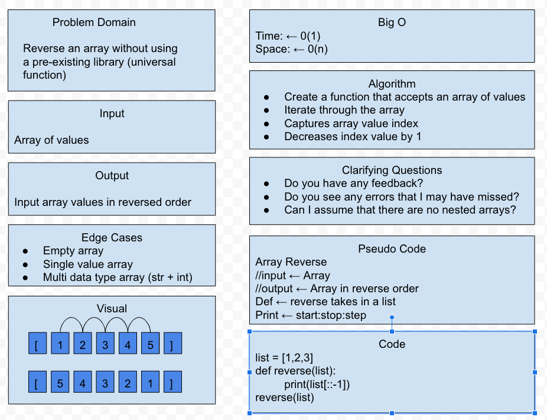

# Reverse an Array 12.07.2020
Reversing an array without using a pre-existing dictionary to do so. 

## Challenge
Write a function called `reverseArray` which takes an array as an argument. Without utilizing any of the built-in methods available to your language, return an array with elements in reversed order.

## Approach & Efficiency
use python skills to reverse an array and print it in reverse.

## Solution

Resources:

https://docs.google.com/drawings/d/18TsKY47rCOz5FN2uFrw5gKM9-1of_whqKE2Wr6CB-1A/edit

Worked with Nick Dorkins

<!-- list example -->
<!-- ### Solar System Exploration, 1950s – 1960s

- [ ] Mercury
- [x] Venus
- [x] Earth (Orbit/Moon)
- [x] Mars
- [ ] Jupiter
- [ ] Saturn
- [ ] Uranus
- [ ] Neptune
- [ ] Comet Haley -->