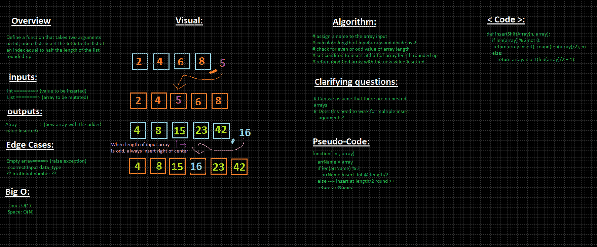

# Array Shift
Inserting numbers into the middle of an array and if odd array then add to the right of the middle number.

## Challenge Description
Write a function called `insertShiftArray` (used snake_case instead) which takes in an array and the value to be added. Without utilizing any of the built-in methods available to your language, return an array with the new value added at the middle index.

## Approach & Efficiency
using not preexisting shift methods to insert a number into the middle of the array

## Solution

Worked with Mason Fryberger