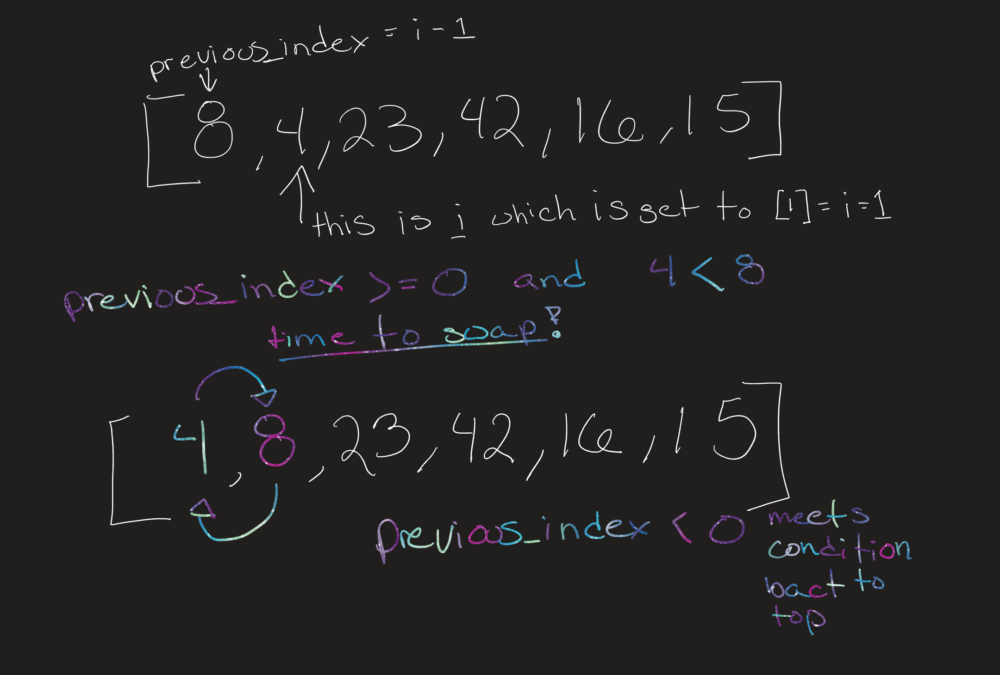

# `insertion_sort()` blog

## **What is insertion sort?** <br>
Insertion Sort organizes an array of values from lowest to highest. It does this by iterating over the array and comparing each value to the values before it. If the previous value is greater then they swap indexes. This happens in a while loop until the current value is not greater or it reaches the beginning of the array. <br>

### [***The dance of Insertion Sort***](https://www.youtube.com/watch?v=ROalU379l3U&ab_channel=AlgoRythmics)
<br>

```
def insertion_sort(array):
    for i in range(1, len(array)):
        previous_index = i - 1
        current_shorts = array[i]

        while previous_index >= 0 and current_shorts < array[previous_index]:
            array[previous_index + 1] = array[previous_index]
            previous_index = previous_index - 1

        array[previous_index + 1] = current_shorts
    return array

```
## Let's walk through and trace the steps!

We start iterating through the array at an index of 1. We use a second variable to track the previous_index. Then we compare the value current index [i] and the previous_index value. Because 8 is greater than 4 we swap the values. Then because previous_index is < 0 the condition is false and the while loop breaks.




