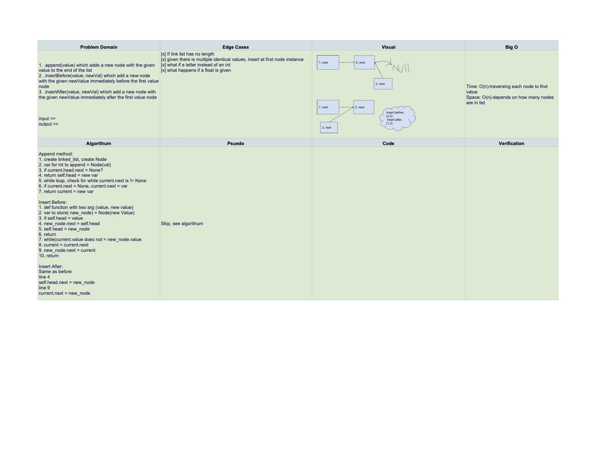

# LL Itereration 12.22.2020 

## Challenge
.append(value) which adds a new node with the given value to the end of the list
.insertBefore(value, newVal) which add a new node with the given newValue immediately before the first value node
.insertAfter(value, newVal) which add a new node with the given newValue immediately after the first value node

## Approach & Efficiency
Mob programming using notes and researching together

## Solution

Resources:
- Mob Programming

Worked with Anthony Beaver, Audrena Vairca, Kim Damalas and Robert Carter. 