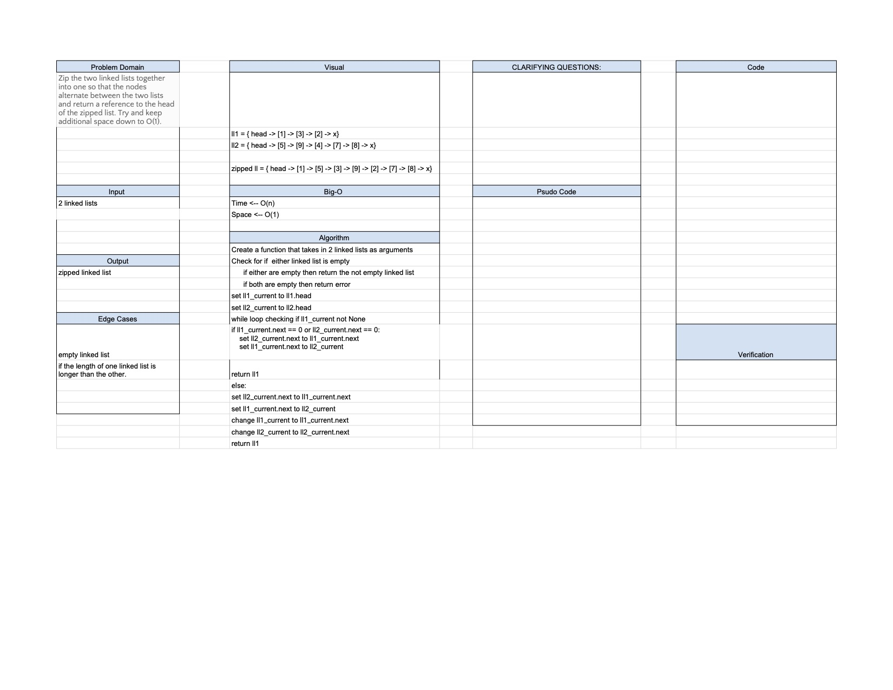

# LL Zip 01.04.2021 

## Challenge
Zip the two linked lists together into one so that the nodes alternate between the two lists and return a reference to the head of the zipped list. Try and keep additional space down to O(1).

## Approach & Efficiency
Problem Solving

## Solution

Resources:
Big O cheetsheet

Worked with Ashley Casimir 