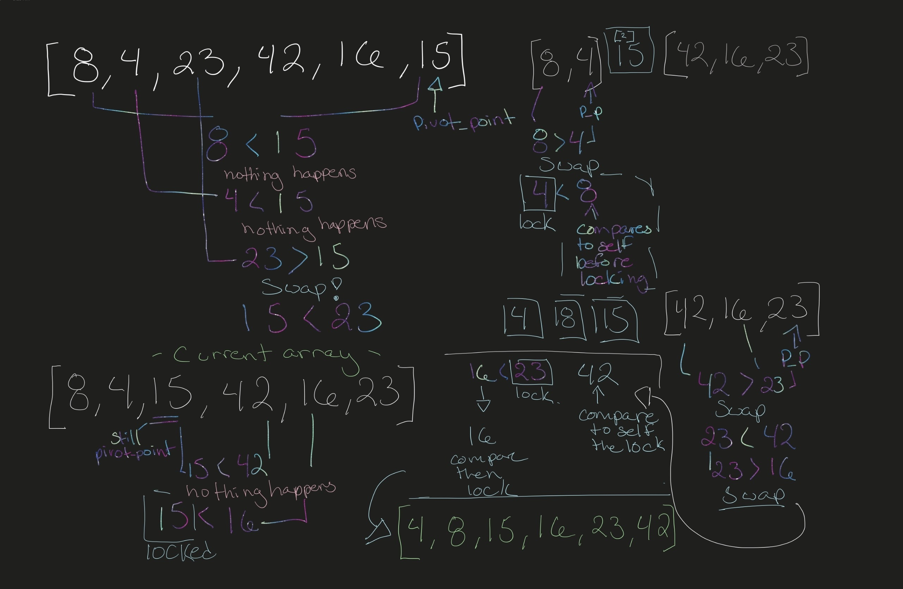
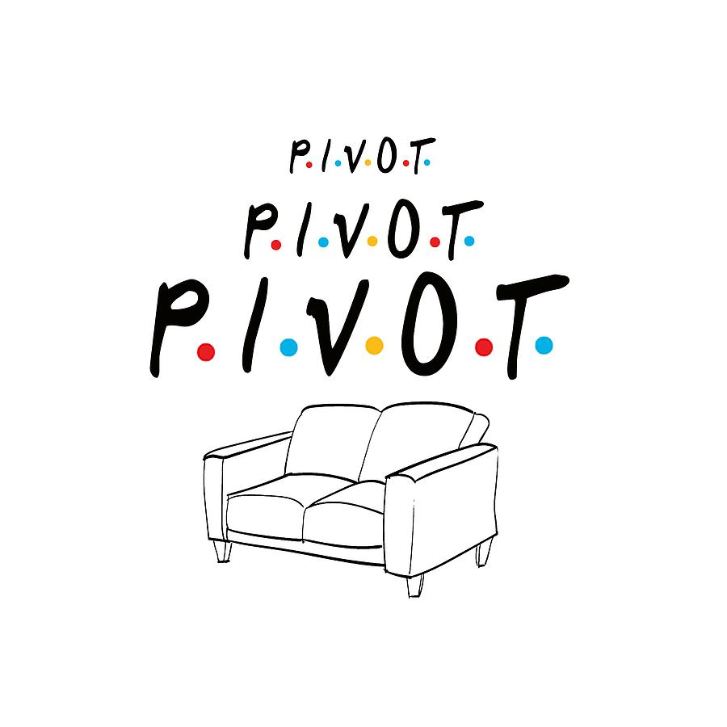

# `quick_sort()` blog

## **What is quick sort?** 
<br>
Quick Sort is a sorting algorithm that starts by defining a pivot point in an unsorted list. Quick sort then partitions the array into 2 halfs around the pivot point swapping lower values to the left and greater values to the right. It does this recursively until each sub arr is only one value long and all the values have been compared. 


<br>

### [***The dance of Quick Sort***](https://www.youtube.com/watch?v=ywWBy6J5gz8&ab_channel=AlgoRythmics)
<br>

```
def quick_sort(arr, left, right):
    if left < right:
        pivot_point = partition(arr, left, right)
        quick_sort(arr, left, pivot_point - 1)
        quick_sort(arr, pivot_point + 1, right)
    return arr

def partition(arr, left, right):
    pivot_compare = arr[right]
    low = left - 1
    for i in range(left, right):
        if arr[i] <= pivot_compare:
            low+=1
            swap(arr, i, low)
    swap(arr, right, low + 1)
    return low + 1

def swap(arr, i, low):
    temp = arr[i]
    arr[i] = arr[low]
    arr[low] = temp


```
## Let's walk through and trace the steps!

Follow the logic in the whiteboard.

<br>



<br>
